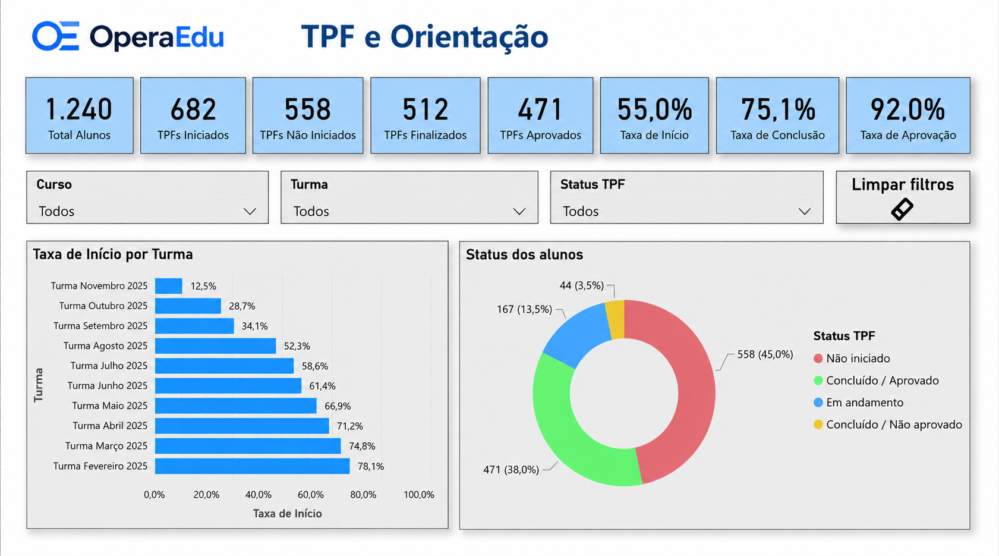

# Dashboard Educacional — TPF e Orientação

### Indicadores de acompanhamento da jornada dos alunos em TPFs

Projeto de Business Intelligence desenvolvido em Power BI para
acompanhamento de indicadores relacionados aos Trabalhos de
Progressão de Formação (TPFs).

## Objetivo

O dashboard foi desenvolvido para transformar dados acadêmicos em
indicadores que permitam acompanhar a jornada dos alunos nos TPFs,
identificar diferenças entre turmas e apoiar o acompanhamento da
operação educacional.

## Principais indicadores

- total de alunos;
- TPFs iniciados;
- TPFs não iniciados;
- TPFs finalizados;
- TPFs aprovados;
- taxa de início;
- taxa de conclusão;
- taxa de aprovação.

## Análises

A página apresenta:

- taxa de início por turma;
- distribuição dos alunos por status do TPF;
- comparação entre diferentes turmas;
- filtros por curso, turma e status;
- indicadores consolidados para acompanhamento da operação.

## Tecnologias

- Power BI
- Power Query
- DAX
- Modelagem de dados
- Visualização de dados

## Interface

*Visão geral dos indicadores de acompanhamento dos TPFs.*

## Sobre os dados

Esta versão foi preparada para apresentação em portfólio.

Os dados apresentados na imagem são fictícios e foram utilizados
exclusivamente para demonstrar a estrutura analítica e visual do
dashboard.

A versão original do projeto utiliza dados institucionais que não são
disponibilizados neste repositório.

## Status

**Projeto de portfólio**

O dashboard representa um case aplicado de Business Intelligence
voltado à análise e acompanhamento de indicadores educacionais.
